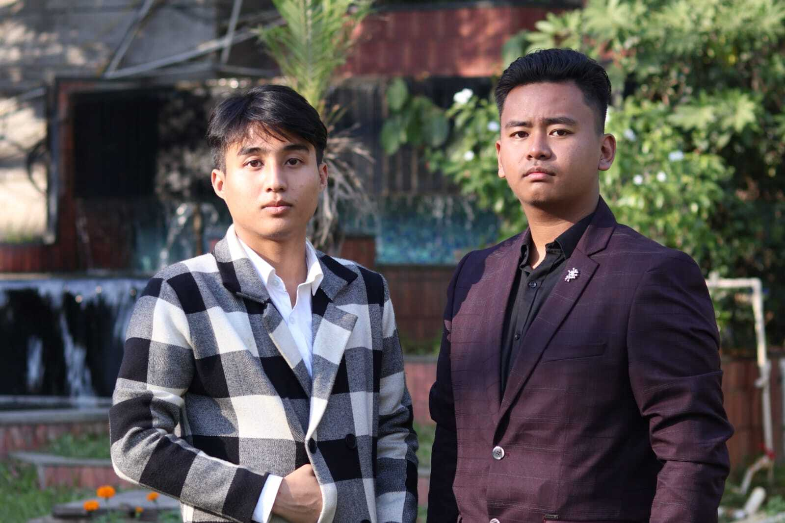

<html lang="en">

<head>
    <meta charset="UTF-8">
    <meta name="viewport" content="width=device-width, initial-scale=1.0">
    <meta http-equiv="X-UA-Compatible" content="ie=edge">
    <title>A Journey of Friendship and Entrepreneurship</title>
    
</head>

<body>

    <header>
        <h1>A Journey of Friendship and Entrepreneurship</h1>
    </header>

    

        <h2 class="article-title">The Story of Khundrakpam Nikhil and Laimayum Aditya Kumar Sharma</h2>

        <!-- Image of Khundrakpam Nikhil and Laimayum Aditya Kumar Sharma -->

    
     <!-- Replace 'profile.jpg' with the path to your image -->

 
        

            In a world full of entrepreneurs, two best friends, <strong>Khundrakpam Nikhil</strong> and <strong>Laimayum Aditya Kumar Sharma</strong>, stand out as shining examples of collaboration, passion, and creativity. Together, they’ve built two successful ventures—<em>Flove</em>, an event planning company, and the canteen at <em>Xtra Edge School</em>. Their story is one of friendship turned into a shared business dream, with each of them contributing their unique strengths to create something meaningful for their community.
        

        <h3 class="section-title">The Birth of <em>Flove</em>: Crafting Events with Heart</h3>

        

            The idea for <em>Flove</em> came from the duo’s shared love of celebrating life’s most significant moments.  Both Khundrakpam Nikhil Founder and Proprietor of Flove and Laimayum Aditya Kumar Sharma Co-founder and Co-Proprietor of flove had always been drawn to events—whether it was weddings, corporate functions, or social gatherings. They recognized an opportunity to blend their creative abilities and organizational talents to offer a service that would provide more than just a well-planned event. They wanted to create experiences—memories that would last a lifetime.
        

        

            <em>Flove</em>—a fusion of the words “flair” and “love”—was born out of their desire to infuse every event with creativity, passion, and attention to detail. Whether it’s designing an unforgettable wedding, organizing a corporate seminar, or planning a birthday party, <em>Flove</em> has quickly become known for its personalized approach. They offer a full range of services, from conceptualizing the event’s theme to handling logistics, decor, catering, and entertainment.
        

        

            Khundrakpam Nikhil’s eye for detail and creativity in design, paired with Laimayum Aditya Kumar Sharma’s organizational skills and business acumen, makes them the perfect team. While one focuses on the aesthetic and experiential elements of the event, the other ensures that everything runs smoothly behind the scenes. This balance of creativity and practicality has allowed <em>Flove</em> to cater to a wide variety of clients, earning them a loyal customer base.
        

        <h3 class="section-title">A New Chapter: Managing the Xtra Edge School Canteen</h3>

        

            While their event planning business flourished, the two best friends took on an additional challenge by managing the canteen at <em>Xtra Edge School</em>. This decision was driven by their desire to contribute to their local community and create a space that would offer more than just food—it would be a place where students could relax, recharge, and socialize.
        

        

            The canteen at <em>Xtra Edge School</em> is now a hub for students, offering them healthy, affordable, and tasty meals that cater to a variety of tastes. The duo understood that school canteens are essential for students' daily routines, and they worked hard to create a menu that balances nutritional value with flavor. From freshly made sandwiches and wraps to hearty meals, the canteen has become a favorite place for students to grab a bite between classes.
        

        

            What sets their canteen apart is not only the quality of the food but also the warm and welcoming atmosphere they’ve created. They ensure that the canteen remains a positive environment where students can interact with each other, unwind, and enjoy their break. Khundrakpam Nikhil and Laimayum Aditya Kumar Sharma are hands-on in running the canteen, personally ensuring that the food meets the highest standards and that students feel comfortable in the space.
        

        <h3 class="section-title">A Partnership Built on Trust and Respect</h3>

        

            At the heart of both <em>Flove</em> and the <em>Xtra Edge School Canteen</em> is the strong friendship and mutual respect between Khundrakpam Nikhil and Laimayum Aditya Kumar Sharma. Their journey together is a perfect example of how personal bonds can fuel entrepreneurial success. Their friendship, which dates back years, forms the foundation of their business partnership. They complement each other in ways that make their business ventures stronger.
        

        

            While Khundrakpam Nikhil’s strengths lie in creativity and client engagement, Laimayum Aditya Kumar Sharma excels in managing day-to-day operations, making them a well-rounded team. Their shared vision and passion for excellence allow them to work seamlessly together, solving problems, making decisions, and ensuring the success of both their ventures.
        

        <h3 class="section-title">Looking Ahead: Growth and Expansion</h3>

        

            As their businesses continue to thrive, Khundrakpam Nikhil and Laimayum Aditya Kumar Sharma have ambitious plans for the future. They hope to expand <em>Flove</em> into new areas of event planning, offering destination weddings, large-scale corporate events, and even customized experiences for unique celebrations. Their goal is to build long-term relationships with clients and vendors alike, ensuring that <em>Flove</em> becomes synonymous with exceptional event planning.
        

        

            In addition to growing <em>Flove</em>, the duo has plans to continue evolving the canteen at <em>Xtra Edge School</em>. They are looking into adding new features, such as cooking classes, interactive food events, and even expanding the menu to include international cuisine. They aim to make the canteen not just a place to eat, but a space where students can learn about healthy eating and even explore culinary creativity.
        

        <h3 class="section-title">A Legacy of Creativity, Friendship, and Service</h3>

        

            The story of Khundrakpam Nikhil and Laimayum Aditya Kumar Sharma is a powerful reminder that friendship, passion, and dedication can drive business success. Through <em>Flove</em>, they bring creativity and attention to detail to every event they organize, ensuring that their clients’ visions come to life. Through the <em>Xtra Edge School Canteen</em>, they provide a vital service to the community, offering healthy food and a place for students to connect and relax.
        

        

            As they continue to grow both businesses, their success is driven by their commitment to excellence, their bond of friendship, and their shared vision for the future. The duo’s journey is just beginning, and with their shared dedication to making a difference in their community, it’s clear that the best is yet to come for Khundrakpam Nikhil and Laimayum Aditya Kumar Sharma.
        

    

    <footer class="footer">
        
&copy;Acc Indian Journal of Entrepreneurship.

    </footer>

</body>

</html>
